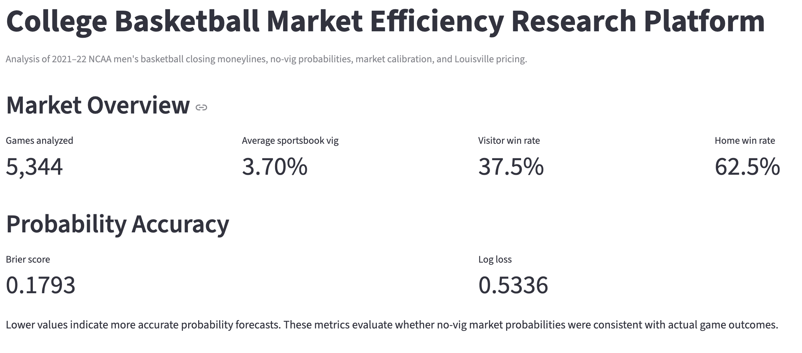
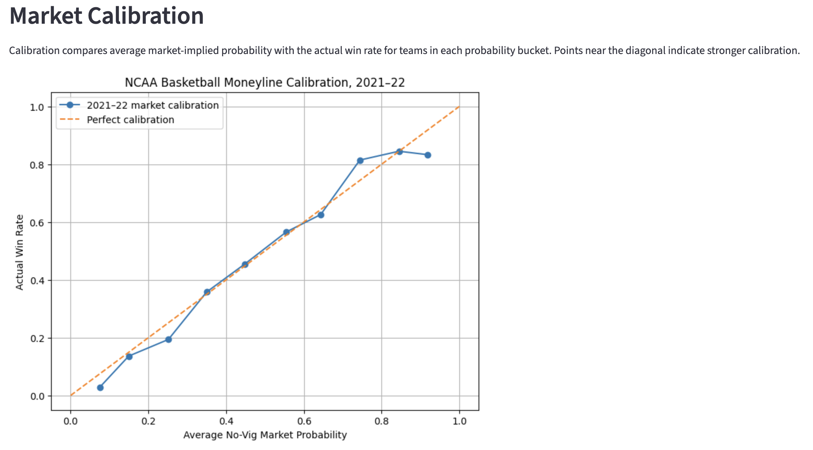
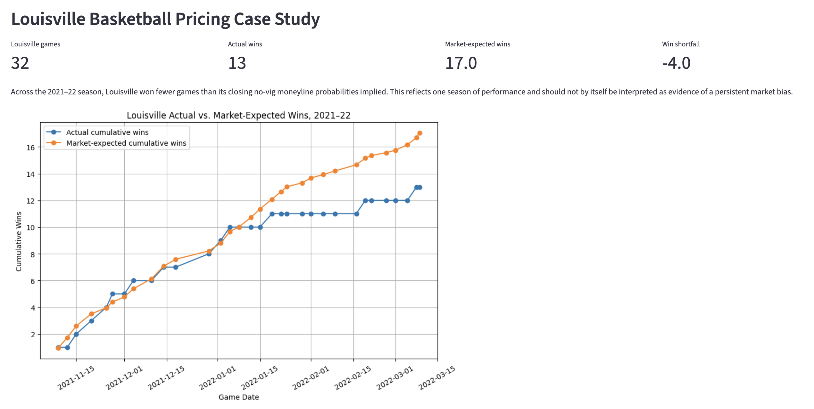

# College Basketball Market Efficiency Research Platform

A Python and SQL research platform that evaluates the accuracy, calibration, and economic efficiency of NCAA men’s basketball betting markets using historical closing moneylines.

The platform converts sportsbook prices into no-vig probabilities, validates and stores the resulting data in SQLite, evaluates forecast accuracy, compares team performance with market expectations, and backtests historical market segments using risk and statistical-uncertainty controls.

The current version analyzes the 2021–22 season and includes an interactive Streamlit dashboard, a Louisville basketball case study, and an exploratory analysis of a single-season market anomaly.

## Dashboard Preview

### Market Overview



The dashboard summarizes SQL-powered market metrics, forecast accuracy, team performance, and automated pipeline validation.

### Market Calibration



The calibration view compares average no-vig market probabilities with actual win rates across probability ranges.

### Louisville Case Study



The Louisville case study compares actual wins with market-expected wins and tracks how pricing error developed throughout the 2021–22 season.

## Project Overview

Sportsbook moneylines can be interpreted as market prices for game outcomes. Raw implied probabilities, however, include the sportsbook’s margin, or **vig**, and therefore sum to more than 100%.

This project:

* converts American moneylines into implied probabilities
* removes the sportsbook vig
* normalizes and maps team names to official NCAA identifiers
* loads cleaned teams, games, prices, and analytical outputs into SQLite
* uses SQL joins, CTEs, aggregations, and window functions
* evaluates forecast accuracy using Brier score and log loss
* measures calibration across probability ranges
* compares favorites, underdogs, home teams, and visitors
* ranks teams by actual wins relative to market-expected wins
* backtests flat-stake market strategies using closing moneylines
* measures ROI, volatility, maximum drawdown, and a Sharpe-like ratio
* estimates uncertainty through bootstrap resampling
* adjusts for within-game dependence and multiple hypothesis testing
* monitors the pipeline through automated data-quality checks
* presents findings through an interactive Streamlit and Plotly dashboard

## Current Dataset

The final 2021–22 analytical dataset contains:

* **5,342 valid games** with complete moneylines and mapped NCAA teams
* **10,684 team-game market observations**
* **99.95% team-name mapping coverage**
* **3.70% average sportsbook vig**
* **0.1793 Brier score**
* **0.5336 log loss**

Two source records reported tied final scores even though NCAA basketball games cannot end in ties. Automated validation identified the records, and they were excluded at the cleaning stage before all downstream outputs were rebuilt.

Three Chaminade games were excluded because the team was not represented in the standard Division I team-ID dataset.

## Main Findings

### Market Calibration

The closing market was generally well calibrated across the middle probability ranges.

Selected results:

* 20%–30% market probability: **19.4% actual win rate**
* 30%–40% market probability: **35.9% actual win rate**
* 40%–50% market probability: **45.5% actual win rate**
* 70%–80% market probability: **80.8% actual win rate**
* 90%–100% market probability: **96.4% actual win rate** across team-level observations used in the backtest

Calibration and profitability are not identical. A segment can win more frequently than its no-vig probability predicts and still lose money after the sportsbook’s quoted odds and vig are applied.

### Broad Strategy Backtests

Hypothetical one-unit wagers at each listed closing moneyline produced:

| Strategy          | Observations |     ROI |
| ----------------- | -----------: | ------: |
| All favorites     |        5,278 |  -1.84% |
| All underdogs     |        5,406 | -13.17% |
| Home favorites    |        3,712 |  -1.78% |
| Home underdogs    |        1,630 |  -5.49% |
| Visitor favorites |        1,566 |  -1.99% |
| Visitor underdogs |        3,776 | -16.48% |

These results show that strong predictive accuracy does not automatically create a profitable betting strategy.

### Exploratory 70%–80% Finding

Teams priced between 70% and 80% no-vig win probability generated:

* **1,039 observations**
* **80.85% hit rate**
* **49.5 units of net profit**
* **4.77% flat-stake ROI**
* **10.3-unit maximum drawdown**
* clustered 95% ROI interval of approximately **1.59% to 7.93%**
* Bonferroni-adjusted interval of approximately **0.21% to 9.21%**

The result remained positive after:

* resampling entire games rather than treating both teams as independent
* adjusting for testing ten probability buckets
* splitting the season chronologically
* comparing home and visitor observations
* examining monthly stability

Four of five monthly periods were positive, and second-half ROI was **6.65%**.

This is a legitimate single-season research finding, but it is **not evidence of a persistent or tradable edge** without out-of-sample validation using additional seasons.

## Louisville Case Study

Across 32 Louisville games:

* actual wins: **13**
* actual win rate: **40.6%**
* average no-vig market probability: **53.2%**
* market-expected wins: approximately **17.0**
* wins relative to expectation: approximately **-4.0**
* average pricing error: **-12.6 percentage points**

Louisville’s five-game rolling pricing error reached approximately **-36.8 percentage points** during the season.

The finding may reflect performance deterioration, coaching instability, roster availability, delayed market adjustment, public expectations, or ordinary one-season variation. It should not be interpreted as proof of a persistent Louisville pricing bias.

## Dashboard

The Streamlit dashboard includes five sections:

### Market Overview

* SQL-powered market KPIs
* Brier score and log loss
* probability calibration
* favorite and underdog segmentation
* team-performance highlights
* Louisville snapshot
* pipeline-quality status

### Team Explorer

* teams ranked by wins above or below market expectation
* interactive team selection
* actual versus expected cumulative wins
* game-level market probabilities and pricing errors

### Louisville Case Study

* actual versus market-expected wins
* rolling five-game pricing error
* game-level moneylines, outcomes, and market roles

### Backtesting & Risk

* flat-stake ROI by probability bucket
* multiple-testing-adjusted confidence intervals
* broad market-strategy returns
* hit rate, volatility, drawdown, and Sharpe-like metrics
* chronological, home/visitor, and monthly robustness analysis

### Data Quality

* duplicate-game checks
* missing-team and missing-moneyline checks
* score and outcome validation
* probability-range and probability-sum checks
* relational-integrity checks between SQLite tables

Run the dashboard locally with:

```bash
streamlit run dashboard/app.py
```

## Data Architecture

```text
Raw NCAA and sportsbook data
        ↓
Python extraction and cleaning
        ↓
Team-name normalization and NCAA ID mapping
        ↓
American-odds and no-vig probability calculations
        ↓
SQLite relational database
        ↓
SQL joins, CTEs, aggregations, and window functions
        ↓
Calibration, team, backtesting, and risk analysis
        ↓
Automated data-quality validation
        ↓
Interactive Streamlit and Plotly dashboard
```

## SQL Layer

The SQLite database contains tables supporting:

* teams
* games
* market prices
* Louisville case-study observations
* broad strategy backtests
* probability-bucket backtests
* bootstrap uncertainty estimates
* chronological robustness analysis
* location robustness analysis
* monthly stability analysis
* clustered and multiple-testing-adjusted results

Representative SQL techniques include:

* relational joins
* `GROUP BY` aggregation
* `CASE WHEN`
* common table expressions
* `UNION ALL`
* rolling window functions
* cumulative sums
* ranking and filtering

## Core Methodology

### 1. Convert American Odds to Implied Probability

For positive American odds:

```text
100 / (odds + 100)
```

For negative American odds:

```text
|odds| / (|odds| + 100)
```

### 2. Remove the Vig

For each two-team market:

```text
No-vig probability =
Team raw implied probability / Combined raw implied probability
```

This forces the two probabilities to sum to 100%.

### 3. Evaluate Probability Accuracy

The project uses:

* **Brier score:** average squared probability error
* **Log loss:** penalizes confident incorrect predictions
* **Calibration error:** actual win rate minus average predicted probability

Lower Brier score and log loss indicate stronger forecasts.

### 4. Calculate Flat-Stake Returns

For a winning positive-moneyline wager:

```text
Profit = stake × odds / 100
```

For a winning negative-moneyline wager:

```text
Profit = stake × 100 / |odds|
```

A losing wager returns the negative stake.

### 5. Evaluate Risk

Backtests include:

* total staked
* net profit
* ROI
* hit rate
* average return
* return volatility
* maximum drawdown
* Sharpe-like return-to-volatility ratio

### 6. Estimate Statistical Uncertainty

The project applies:

* 5,000-sample bootstrap confidence intervals
* chronological first-half and second-half validation
* home and visitor subgroup validation
* monthly stability analysis
* game-clustered bootstrap resampling
* Bonferroni adjustment across ten probability buckets

## Data Quality

The pipeline automatically checks:

* duplicate game identifiers
* missing team IDs
* missing moneylines
* invalid or missing scores
* invalid binary outcomes
* probabilities outside the zero-to-one range
* no-vig probabilities that fail to sum to one
* games without matching price records
* price records without matching games

All current validation checks pass.

## Project Structure

```text
cbb-market-efficiency/
├── dashboard/
│   └── app.py
├── data/
│   ├── raw/
│   ├── processed/
│   └── database/
├── reports/
│   ├── charts/
│   └── screenshots/
├── scripts/
│   ├── 01_...
│   └── 20_load_backtests_to_sql.py
├── sql/
│   └── market_analysis.sql
├── src/
│   ├── odds.py
│   ├── vig.py
│   ├── metrics.py
│   ├── calibration.py
│   └── backtest.py
├── tests/
├── README.md
├── research_memo.md
├── requirements.txt
└── pytest.ini
```

Generated datasets and the SQLite database are excluded from GitHub and can be recreated through the project scripts.

## Technology

* Python
* SQL
* SQLite
* pandas
* NumPy
* scikit-learn
* SciPy
* Streamlit
* Plotly
* matplotlib
* pytest
* Git and GitHub

## Testing

Run unit tests with:

```bash
pytest
```

Current tests cover:

* American-odds conversion
* invalid-odds handling
* reverse probability-to-odds conversion
* two-way vig removal

Automated SQL-level data-quality checks provide additional validation across the full analytical dataset.

## Data Sources

The project uses:

* NCAA men’s basketball team and game-result data from the Kaggle March Machine Learning Mania dataset
* historical moneyline and score data from the Sportsbook Review Online NCAA basketball archive

Team names are normalized and matched to official NCAA identifiers before analysis.

## Limitations

* The market and backtesting analysis currently covers only the 2021–22 season.
* The odds archive may represent one reported closing line rather than a consensus market price.
* Historical listed prices may not have been available at meaningful size at every sportsbook.
* The project does not model sportsbook limits, rejected wagers, slippage, or line movement.
* Bootstrap methods do not substitute for true out-of-sample testing.
* The 70%–80% result was discovered and evaluated using the same season.
* Multiple-testing adjustment reduces but does not eliminate data-mining risk.
* Injuries, suspensions, coaching changes, and roster availability are not modeled directly.
* Additional seasons are required to assess persistence.

## Planned Expansion

Future versions may:

* add another season when a reliable historical odds source becomes available
* perform true out-of-sample validation of the 70%–80% finding
* compare opening and closing prices
* examine regular-season and NCAA Tournament pricing separately
* add neutral-site and conference-level analysis
* model team strength and recent form
* add bankroll and position-sizing simulations
* compare flat staking with fractional Kelly sizing
* expand automated tests and pipeline orchestration

## Research Conclusion

The 2021–22 NCAA men’s basketball closing moneyline market demonstrated strong predictive information and generally reasonable calibration.

Broad favorite and underdog strategies lost money after quoted sportsbook prices were applied, illustrating that forecasting accuracy and betting profitability are different questions.

One probability segment—the 70%–80% no-vig bucket—produced positive single-season returns that remained statistically positive after clustered bootstrap resampling and adjustment for testing ten buckets. The result is promising as a research anomaly but remains exploratory until it can be evaluated on an independent season.
